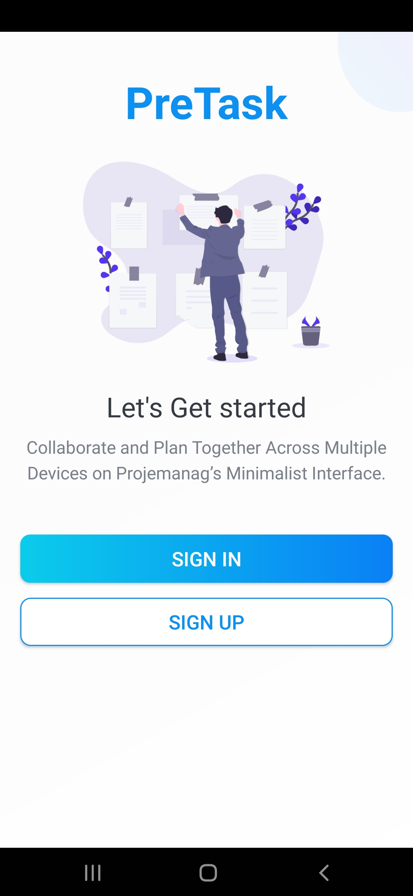
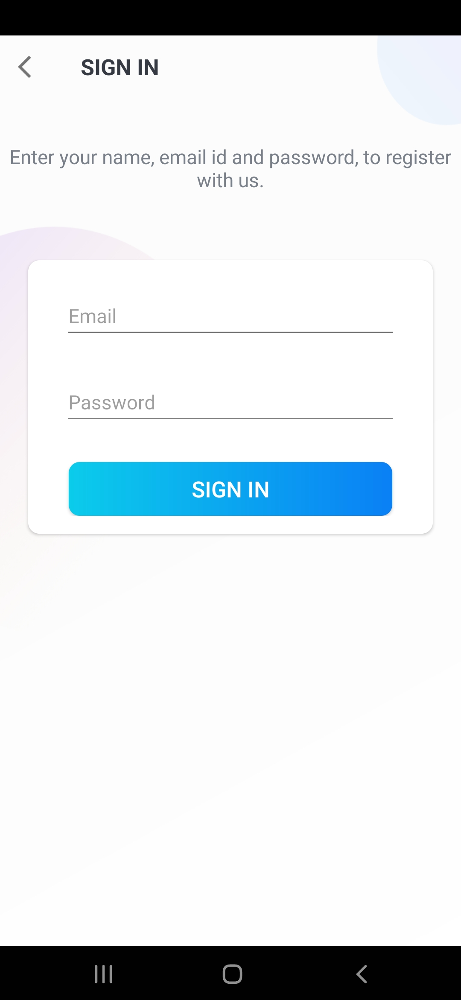

# PreTask

PreTask is a project planner app that allows an enterprise to plan their projects work within a team.

Allows user to register / login with email. User can create task boards and cards to monitor work to be done.

 
 
<table>
  <tr>
    <td>Splash Screen</td>
     <td>Sign in OR Register</td>
     <td>Sign in to your account</td>
  </tr>
  <tr>
    <td></td>
    <td></td>
    <td></td>
  </tr>
  
  <tr>
     <td>All the boards that user creates</td>
     <td>Create a new board</td>
     <td>All tasks and cards</td>
  </tr>
  <tr>
    <td></td>
    <td></td>
    <td></td>
  </tr>
  
  <tr>
     <td>Can add a new member to board</td>
     <td>Assign member to cards></td>
  </tr>
  <tr>
    <td></td>
    <td></td>
  </tr>
 </table>
